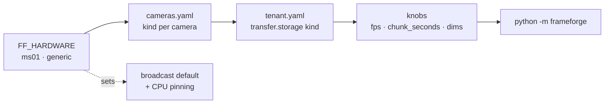

# frameforge

[](https://github.com/talmolab/frameforge/actions/workflows/ci.yml)
[](LICENSE)

Multi-camera acquisition, encoding, and recording pipeline for behavioral labs.

frameforge runs on a Linux box next to the cameras. It grabs frames, encodes them to H.264,
writes wall-clock-aligned MP4 chunks with per-frame timestamp sidecars, and uploads them to
your storage — with host-side back-pressure so a slow encoder never costs the recording a
frame, an optional low-latency live view, and Prometheus metrics for every worker. It records
production home-cage rodent monitoring at the Salk Institute, six cameras per box, around the
clock.

## Architecture

A supervisor spawns one acquisition and one encoder process per camera, joined by a
shared-memory frame ring, plus one transfer, metrics, and host-sampler process:

```
cameras → acquisition ─┬─ record ring ──── encoder ── .mp4 chunks + .h5 sidecars ── transfer → storage
                       └─ broadcast ring ── broadcast ── mediamtx ────────────────── WebRTC (live view)
         all workers ─────────────────── metrics ── Prometheus ──────────────────── Grafana
```

- **Recording** is `libx264` at a fixed quality target, `+faststart` MP4, one chunk per
  `chunk_seconds` aligned to local midnight. Chunk `NN` counts elapsed chunks since midnight,
  so with hourly chunks DST days produce 0–22 or 0–24 without gaps or repeats.
- **Sidecar** `.h5` per chunk holds the host timestamp of every frame.
- **Back-pressure**: when the ring is full, acquisition drops at the host and counts it. The
  encoder never sees a partial frame.
- **Broadcast** is a subsampled, throwaway stream on its own ring, hardware-encoded, pushed to
  a local mediamtx for WebRTC viewing.
- **Drain**: `SIGTERM` finishes the current chunk then stops; `SIGINT` aborts it now.

Recordings land as `<root>/<session>/<cam_id>/<YYYY-MM-DD-00-00-00>/<cam_id>.<NN>.mp4`, where
`session` defaults to today's date.

## Requirements

- Linux, Python 3.13, [uv](https://docs.astral.sh/uv/)
- `ffmpeg` on the PATH (recording and broadcast both run it as a subprocess)
- A camera SDK for your source kind (see below) and credentials for your storage kind

## Install

```bash
git clone https://github.com/talmolab/frameforge.git && cd frameforge
uv sync --extra pylon            # Basler cameras; add --extra s3 for S3 storage
```

pypylon is an optional extra because Basler distributes it under its own license. The base
install is pure MIT.

## Quick start

frameforge reads two YAML files and a secrets environment. From a checkout, point it at a
config directory and a scratch directory:

```bash
mkdir -p cfg scratch
cp config/tenants/example.yaml cfg/tenant.yaml     # storage destination
cp config/cameras.example.yaml cfg/cameras.yaml    # camera ids + serials
export SMB_USER=... SMB_PASS=...                   # or AWS_ACCESS_KEY_ID / AWS_SECRET_ACCESS_KEY
FF_CONFIG_DIR=$PWD/cfg FF_SCRATCH_DIR=$PWD/scratch FF_PROM_DIR=$PWD/scratch/prom uv run python -m frameforge
```

Metrics appear on `:9100/metrics` within a few seconds; the first chunk closes at the next
`chunk_seconds` boundary. For a permanent box, use the systemd deployment under
[deploy/](deploy/) instead (see the reference deployment below).

## Configuration

A deployment picks three things, then sets a handful of knobs:



**`tenant.yaml`** — one file per storage destination, shared by every rig that writes there.

| key | default | what it controls |
|---|---|---|
| `transfer.storage.kind` | required | `smb` or `s3` |
| `transfer.storage.*` | required | backend keys: `server`, `share`, `root` for smb; `bucket` (+ `prefix`, `endpoint_url`, `region`) for s3 |
| `transfer.analytics` | `false` | `ffprobe` each chunk before upload and log frames, duration, size |
| `encode.fps` | `50` | camera frame rate; also fixes frames per chunk |
| `encode.chunk_seconds` | `3600` | chunk length; indices are elapsed chunks since local midnight |
| `acq.width` / `acq.height` / `acq.channels` | `1280` / `1024` / `1` | frame geometry; channels 1 = gray, 3 = RGB |
| `acq.jumbo_frames` | `false` | GigE packet size 9000 instead of 1500; needs switch support |
| `acq.gige_subnet` | `192.168.10` | GigE cameras are ForceIp'd to `<subnet>.10N` from `cam_0N` |
| `broadcast.enabled` | from hardware | turn the live stream off on hardware that supports it |
| `session_name` | today's date | top-level folder under the storage root |

**`cameras.yaml`** — one entry per camera on this rig.

| key | default | what it controls |
|---|---|---|
| `id` | required | camera name in paths and metrics; a trailing number drives the GigE IP |
| `kind` | `pylon` | source backend |
| `serial` | first camera found | Basler serial to bind to |
| `pfs` | programmatic defaults | Pylon Viewer feature file for exposure, gain, ROI |

**Environment**

| variable | default | what it controls |
|---|---|---|
| `FF_HARDWARE` | `generic` | hardware class: CPU pin map, broadcast codec and default |
| `FF_CONFIG_DIR` | `/etc/frameforge` | where `tenant.yaml` and `cameras.yaml` live |
| `FF_SCRATCH_DIR` | `/var/lib/frameforge/scratch` | local chunk staging before upload |
| `FF_PROM_DIR` | `/run/frameforge/prom` | Prometheus multiprocess files |
| `SMB_USER` / `SMB_PASS` | — | SMB credentials |
| `AWS_*` | — | S3 credentials via the standard boto3 chain |

Encoder tuning (preset, CRF, GOP), ring depth, and the low-disk threshold are constants in
the code, not deployment knobs.

## Supported backends

| seam | kinds | where |
|---|---|---|
| camera source | `pylon` (Basler GigE and USB3) | [frameforge/sources/](frameforge/sources/) |
| storage | `smb`, `s3` (and S3-compatible via `endpoint_url`) | [frameforge/storage/](frameforge/storage/) |
| hardware class | `ms01` (Intel QSV broadcast, 6-camera pin map), `generic` (no pinning, no broadcast) | [frameforge/core/hardware.py](frameforge/core/hardware.py) |

Adding a kind: implement the protocol at the top of the package `__init__`, register its name
and option keys in the table there, and add a lazy import branch to the factory. A hardware
class is a `HardwareSpec` entry with its pin function and broadcast codec arguments.

## Reference deployment

The Salk rigs are Minisforum MS-01 boxes running six Basler acA1300-75gm GigE cameras at
50 fps through a PoE switch on a dedicated NIC, recording to an SMB share, with Intel QSV
for the live stream and Prometheus plus Grafana on the box. Two idempotent scripts bring one
up:

```bash
sudo FF_HOSTNAME=lab-rig01 CAMERA_IFACE=enp1s0 ./deploy/scripts/bootstrap-box.sh --with-broadcast
sudo ./deploy/scripts/install-frameforge.sh
sudo systemctl start frameforge
```

[deploy/SETUP.md](deploy/SETUP.md) has the full bring-up, the network prerequisites, and the
upgrade notes.

## Operations

```bash
sudo journalctl -u frameforge -f              # live logs
sudo systemctl restart frameforge             # graceful: finish current chunk, then start
sudo systemctl stop frameforge                # soft drain: finish chunk, then stop
sudo systemctl kill -s SIGINT frameforge      # hard drain: abort chunk now
```

Dashboards: Grafana on `:3000`, raw metrics on `:9100`, live camera view via mediamtx on
`:8889`. Each rig also publishes a heartbeat to `<root>/_ff_heartbeat/<hostname>.json`;
serve [tools/](tools/) with `npx serve -p 8080 tools` and point the console at that folder for
a fleet-wide view. `tools/calibrator.py` gives a live focus and exposure readout for lens
tuning.

## Issues & Support

**Technical issue with the software?** Search the [issues on GitHub](https://github.com/talmolab/frameforge/issues) or open a new one.

**General inquiries?** Reach out to [talmo@salk.edu](mailto:talmo@salk.edu).

## License

frameforge is released under an [MIT License](LICENSE). Camera access uses [pypylon](https://github.com/basler/pypylon), which is distributed by Basler under its own license and installed separately as an optional extra.
